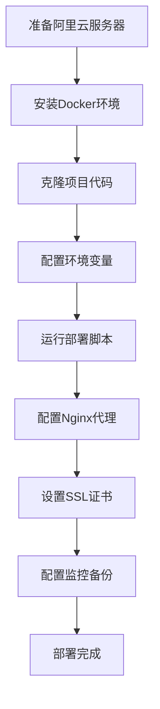

# 🚀 QAToolBox 阿里云快速部署指南

## 📋 部署流程概览



## 🔧 一键部署命令

### 服务器准备（CentOS 7/8）
```bash
# 1. 更新系统
sudo yum update -y

# 2. 安装Docker
sudo yum install -y yum-utils
sudo yum-config-manager --add-repo https://download.docker.com/linux/centos/docker-ce.repo
sudo yum install -y docker-ce docker-ce-cli containerd.io
sudo systemctl start docker
sudo systemctl enable docker
sudo usermod -aG docker $USER

# 3. 安装Docker Compose
sudo curl -L "https://github.com/docker/compose/releases/download/v2.21.0/docker-compose-$(uname -s)-$(uname -m)" -o /usr/local/bin/docker-compose
sudo chmod +x /usr/local/bin/docker-compose
sudo ln -s /usr/local/bin/docker-compose /usr/bin/docker-compose

# 4. 重新登录以应用docker组权限
exit
# 重新SSH登录
```

### 项目部署
```bash
# 1. 克隆项目
cd /opt
sudo git clone https://github.com/shinytsing/QAToolbox.git
sudo chown -R $USER:$USER QAToolbox
cd QAToolbox

# 2. 运行一键部署脚本
./deploy_aliyun_simple.sh

# 3. 按提示完成配置
```

## ⚙️ 关键配置文件

### 环境变量 (.env)
```bash
# 必须修改的配置
DJANGO_SECRET_KEY=your-generated-secret-key
ALLOWED_HOSTS=your-domain.com,your-server-ip
DB_PASSWORD=your-secure-password

# 可选配置
EMAIL_HOST=smtp.your-provider.com
EMAIL_HOST_USER=your-email@domain.com
EMAIL_HOST_PASSWORD=your-password
```

### Nginx配置
```nginx
# /etc/nginx/conf.d/qatoolbox.conf
server {
    listen 80;
    server_name your-domain.com;

    location /static/ {
        alias /opt/QAToolbox/staticfiles/;
    }

    location /media/ {
        alias /opt/QAToolbox/media/;
    }

    location / {
        proxy_pass http://127.0.0.1:8000;
        proxy_set_header Host $host;
        proxy_set_header X-Real-IP $remote_addr;
        proxy_set_header X-Forwarded-For $proxy_add_x_forwarded_for;
    }
}
```

## 🔐 安全配置

### 防火墙设置
```bash
sudo firewall-cmd --permanent --add-service=http
sudo firewall-cmd --permanent --add-service=https
sudo firewall-cmd --permanent --add-port=22/tcp
sudo firewall-cmd --reload
```

### SSL证书（Let's Encrypt）
```bash
sudo yum install -y epel-release
sudo yum install -y certbot python3-certbot-nginx
sudo certbot --nginx -d your-domain.com
```

## 📊 监控和维护

### 服务状态检查
```bash
# 查看所有容器状态
docker-compose -f docker-compose.simple.yml ps

# 查看日志
docker-compose -f docker-compose.simple.yml logs

# 重启服务
docker-compose -f docker-compose.simple.yml restart
```

### 备份设置
```bash
# 设置自动备份
/opt/backups/backup_qatoolbox.sh

# 添加定时任务
echo "0 2 * * * /opt/backups/backup_qatoolbox.sh" | crontab -
```

## 🎯 验证部署

### 功能检查清单
- [ ] 网站首页可访问：`http://your-server-ip:8000`
- [ ] 管理后台可登录：`http://your-server-ip:8000/admin/`
- [ ] 用户注册功能正常
- [ ] 静态文件加载正常
- [ ] 数据库连接正常
- [ ] Redis缓存工作
- [ ] SSL证书有效

### 性能测试
```bash
# 简单压力测试
curl -o /dev/null -s -w "%{time_total}\n" http://your-domain.com

# 并发测试（如果安装了ab）
ab -n 100 -c 10 http://your-domain.com/
```

## 🆘 故障排除

### 常见问题

1. **容器启动失败**
```bash
docker-compose -f docker-compose.simple.yml logs web
```

2. **端口被占用**
```bash
sudo netstat -tulpn | grep :8000
sudo lsof -i :8000
```

3. **权限问题**
```bash
sudo chown -R $USER:$USER /opt/QAToolbox
```

4. **内存不足**
```bash
free -h
docker system prune -a
```

## 📱 移动端优化

项目已适配移动端，确保以下配置：
- 响应式设计已启用
- 静态文件压缩
- CDN配置（可选）

## 🔄 更新部署

```bash
# 1. 拉取最新代码
cd /opt/QAToolbox
git pull origin main

# 2. 重新构建和部署
docker-compose -f docker-compose.simple.yml down
docker-compose -f docker-compose.simple.yml build --no-cache
docker-compose -f docker-compose.simple.yml up -d

# 3. 运行迁移
docker-compose -f docker-compose.simple.yml exec web python manage.py migrate
docker-compose -f docker-compose.simple.yml exec web python manage.py collectstatic --noinput
```

## 📞 技术支持

### 日志位置
- 应用日志：`/opt/QAToolbox/logs/`
- Nginx日志：`/var/log/nginx/`
- 系统日志：`/var/log/messages`

### 重要端口
- Web应用：8000
- PostgreSQL：5432
- Redis：6379
- Nginx：80, 443

---

🎉 **恭喜！您已成功部署QAToolBox到阿里云！**

记得定期更新系统和应用，保持服务器安全。
